# DecifrAI 🧞

> Eu sei quem você está pensando...

**DecifrAI** é um jogo de adivinhação onde uma IA tenta descobrir em qual personagem — real ou fictício — você está pensando. Através de perguntas de sim/não/talvez, o gênio vai afunilando as possibilidades até revelar quem é.

---

## 🚀 Tecnologias

- **React Native** — desenvolvimento mobile multiplataforma
- **Formik + Yup** — gerenciamento e validação de formulários
- **Navegação por telas** — fluxo completo de autenticação e jogo

---

## 📱 Telas

### Onboarding

Apresentação do jogo em três slides antes do login.

<p align="center">
  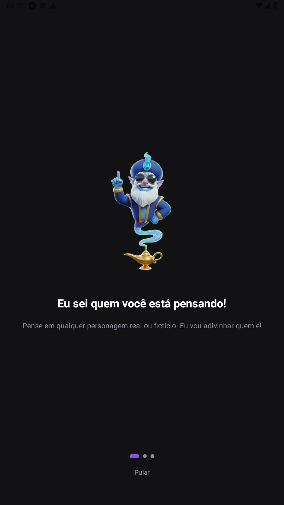
  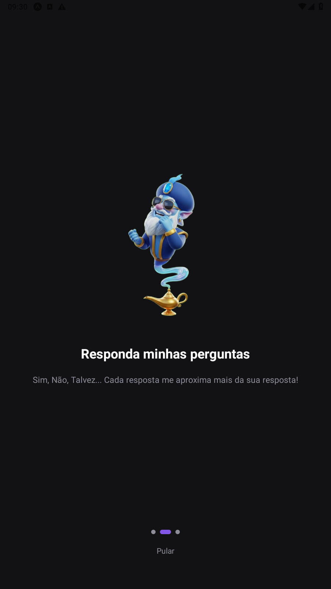
  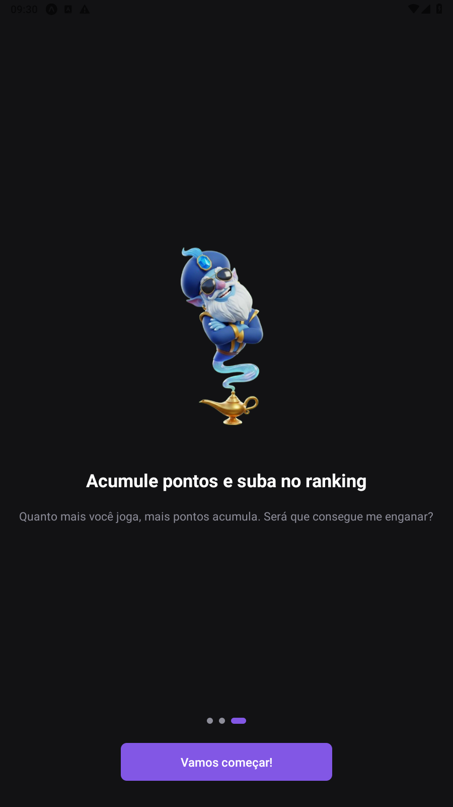
</p>

---

### Autenticação

Fluxo de login, cadastro e recuperação de senha com validação em tempo real.

<p align="center">
  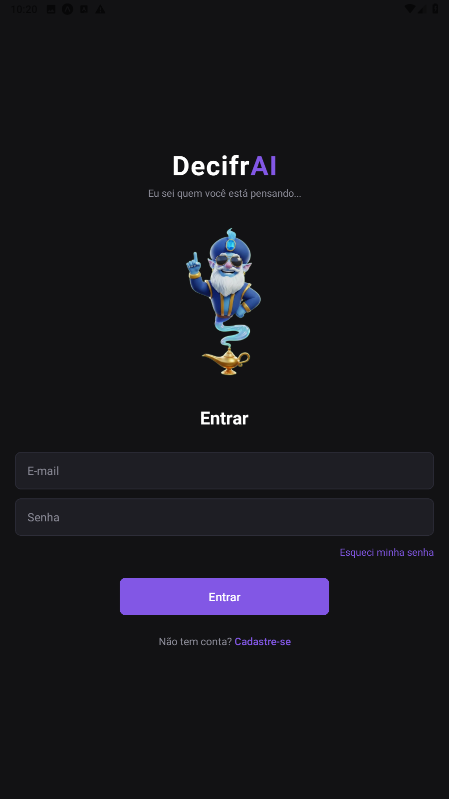
  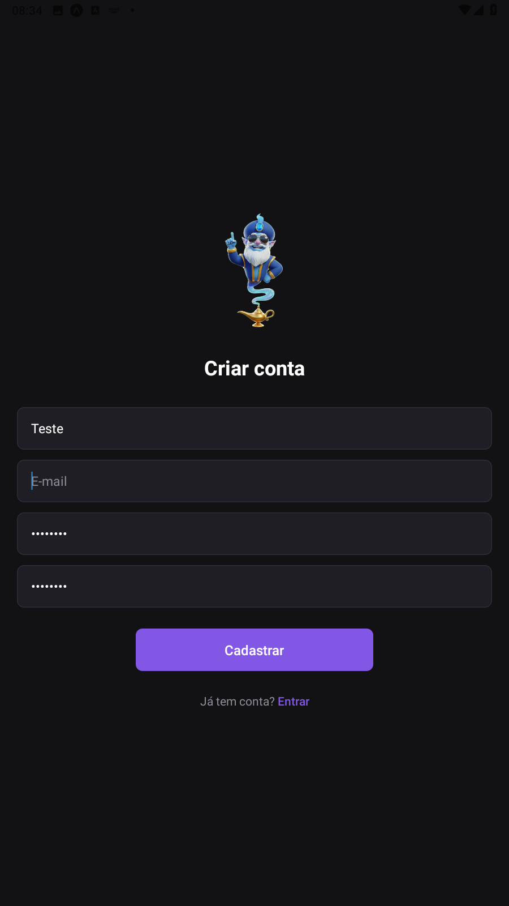
  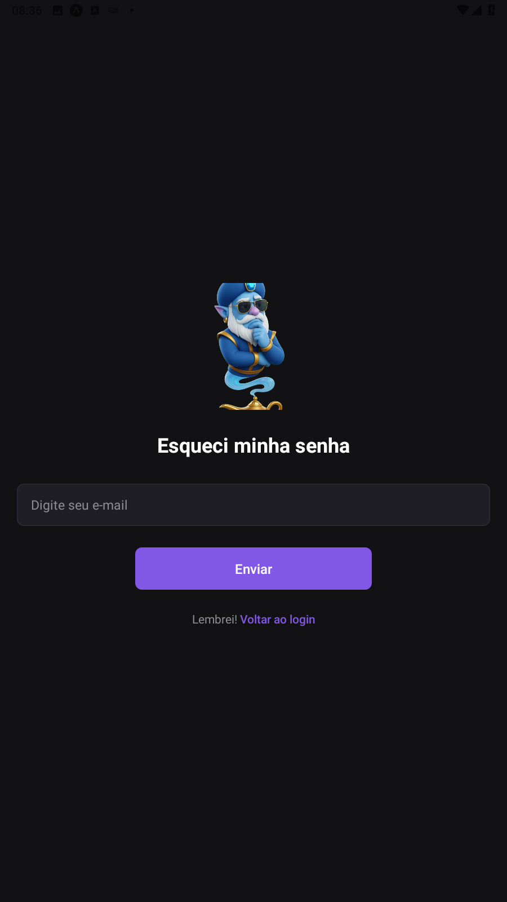
</p>

---

### Home

Tela principal com acesso rápido ao jogo, estatísticas e últimas partidas.

<p align="center">
  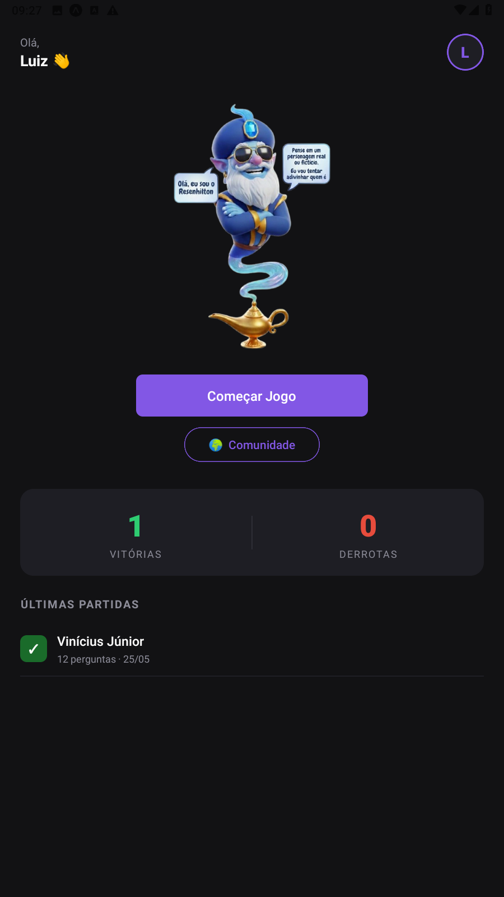
</p>

---

### Jogo

O gênio faz perguntas e o jogador responde com: Sim, Não, Talvez, Não sei, Provavelmente sim ou Provavelmente não. Quando os tokens acabam, o gênio revela o palpite.

<p align="center">
  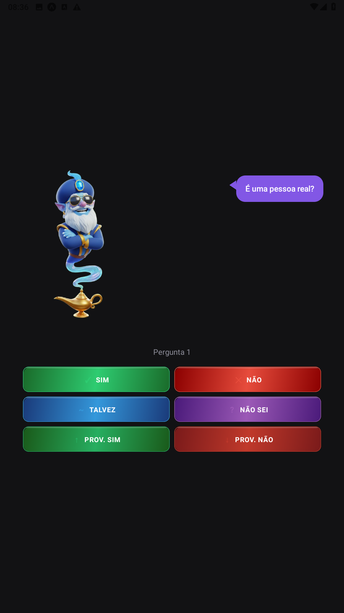
  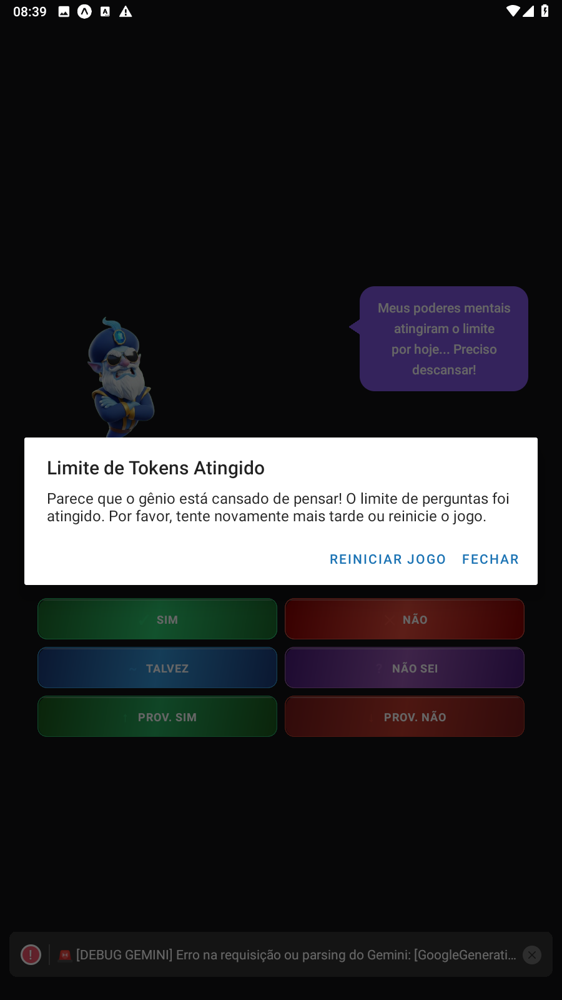
</p>

---

### Resultado

Ao final, o gênio revela a imagem de quem estava pensando. Se errar, o jogador pode informar o nome correto.

<p align="center">
  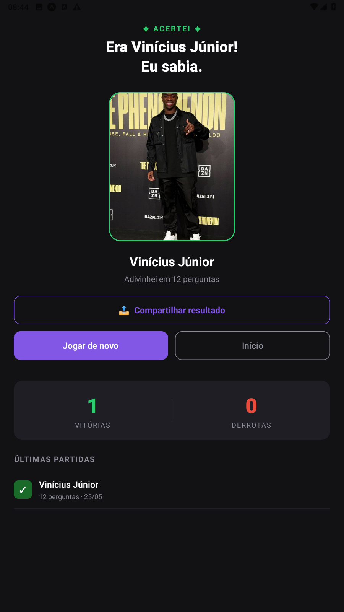
</p>

---

### Perfil

Gerencie foto de perfil e acompanhe suas estatísticas: vitórias, derrotas, taxa de acerto e sequência.

<p align="center">
  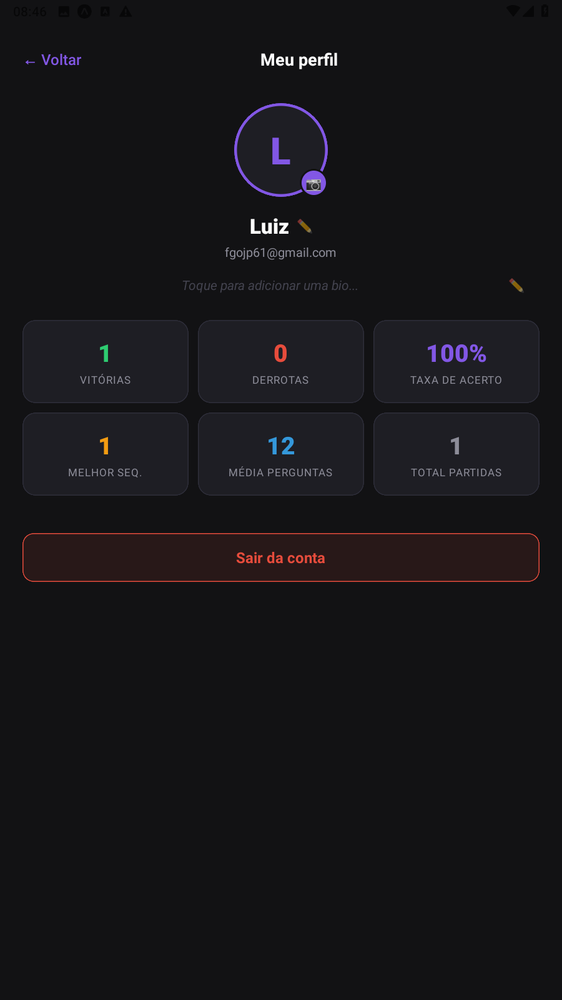
  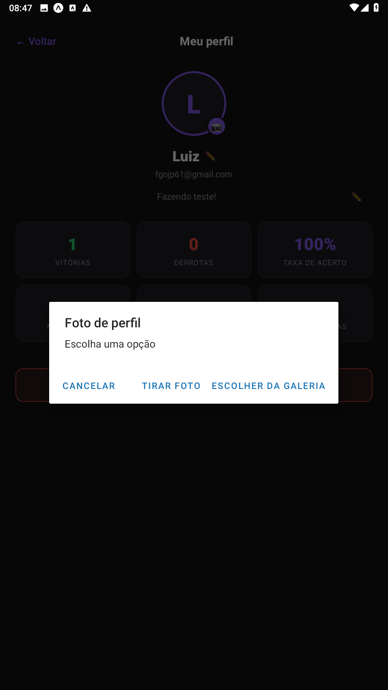
</p>

---

### Comunidade & Ranking

Ranking global por pontuação e feed ao vivo com as partidas recentes da comunidade.

<p align="center">
  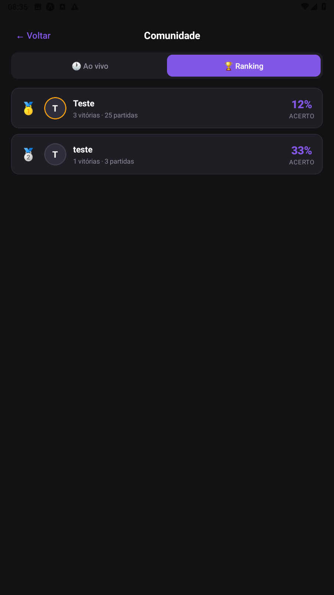
  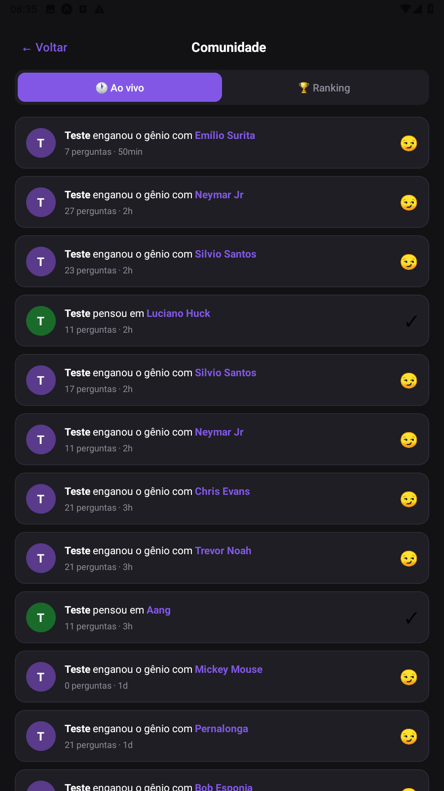
</p>

---

## 📂 Como rodar

```bash
# Clone o repositório
git clone https://github.com/luizedu0494/DecifrAI

# Instale as dependências
npm install

# Inicie o projeto
npx expo start
```

---

## 👤 Autor

Feito por **Luiz Eduardo** — [github.com/luizedu0494](https://github.com/luizedu0494)

---

## 🤖 Uso de Inteligência Artificial

Este projeto foi desenvolvido com auxílio de ferramentas de Inteligência Artificial, utilizadas como suporte na criação de lógica, estruturação de código e documentação."# DecifrAI-SQL-" 
